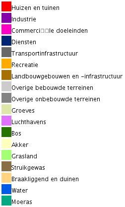
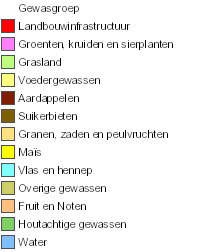

# Op zoek naar alternatieve kaartlagen

De belangrijkste voorwaarde is een kaartlaag die bruikbare informatie levert om te bepalen wat open ruimte voor de patrijs is en wat niet.

Een belangrijke randvoorwaarde die we stellen is dat de kaartlaag als open data beschikbaar moet zijn.
Verder willen we een kaart die voldoende recent is en regelmatig zal bijgewerkt worden in de toekomst.
Anders lopen we binnen een paar jaar terug tegen het probleem aan waar we met de eerste kaart mee kampten, namelijk verouderd kaartmateriaal.

Om het verschil tussen de verschillende kaartlagen zichtbaar te maken tonen we telkens een kaart van hetzelfde gebied in Vlaanderen.
Figuur \@ref(fig:basis) toont de meest recente luchtfoto's van dit gebied.
We selecteerden dit gebied omdat het een inzicht geeft in de verschillen tussen de kaartlagen.
In de online versie van dit rapport zijn de kaarten interactief.
Daar kan de lezer de kaart verplaatsen naar een gebied naar eigen keuze.
De lezer kan in de online eveneens de laag met de jachtterreinen activeren.

```{r basis, fig.cap = "Basiskaart met de meest recente luchtfoto's."}
basis <- leaflet(width = "100%", height = "770") %>%
  setView(lat = 50.75695, lng = 4.00905, zoom = 15) %>%
  addWMSTiles(
    paste(
      "https://geoservices.informatievlaanderen.be", "raadpleegdiensten",
      "OMWRGBMRVL", "wms",
      sep = "/"
    ),
    layers = "Ortho", group = "orthofoto",
    options = WMSTileOptions(
      format = paste("image", "png", sep = "/"), transparent = TRUE
    ),
    attribution = paste(
      "AIV <a href='https://overheid.vlaanderen.be", "sites", "default",
      "files", "documenten", "ict-egov", "licenties", "hergebruik",
      "modellicentie_gratis_hergebruik_v1_0.html'>Gratis hergebruik</a>",
      sep = "/"
    )
  ) %>%
  addWMSTiles(
    paste(
      "https://geoservices.informatievlaanderen.be", "raadpleegdiensten",
      "Jacht", "wms",
      sep = "/"
    ),
    layers = "Jachtterr", group = "jachtterreinen",
    options = WMSTileOptions(
      format = paste("image", "png", sep = "/"), transparent = TRUE
    ),
    attribution = paste(
      "AIV <a href='https://overheid.vlaanderen.be", "sites", "default",
      "files", "documenten", "ict-egov", "licenties", "hergebruik",
      "modellicentie_gratis_hergebruik_v1_0.html'>Gratis hergebruik</a>",
      sep = "/"
    )
  )
basis %>%
  addLayersControl(
    baseGroups = "orthofoto", overlayGroups = "jachtterreinen",
    options = layersControlOptions(collapsed = FALSE)
  ) %>%
  hideGroup("jachtterreinen")
```

## Groenkaart {#s:groenkaart}

Bron: <https://www.geopunt.be/catalogus/datasetfolder/2c64ca0c-5053-4a66-afac-24d69b1a09e7>

De meest recente versie geeft het landgebruik voor 2018 weer.
In principe zal men de kaart elke drie jaar vernieuwen.
De kaart is beschikbaar onder de [modellicentie gratis hergebruik](https://overheid.vlaanderen.be/sites/default/files/documenten/ict-egov/licenties/hergebruik/modellicentie_gratis_hergebruik_v1_0.html).
Het betreft een rasterkaart met resolutie van 1 x 1 m gebaseerd op zomerluchtfoto's.

Een segmentatiealgoritme deelt de rastercellen op in vier klassen: "landbouw", "laag groen", "hoog groen" en "niet groen".
De klasse "laag groen" maakt deze laag minder geschikt als bron.
Ze omvat zowel relevante gebieden (graslanden) als niet relevante gebieden (tuinen, jonge bossen, ...).
Daarnaast is deze kaart niet foutenvrij doordat het segmentatiealgoritme de luchtfoto's niet steeds correct interpreteert.
Zo werden verschillende akkers waar op het moment van de foto veel plassen op stonden foutief geklasseerd als "niet groen".

(ref:groenkaart) Groenkaart versie 2018. De legende is beschikbaar in fig. \@ref(fig:groenkaart-legende).

```{r groenkaart, fig.cap = "(ref:groenkaart)"}
basis %>%
  addWMSTiles(
    paste(
      "https://geoservices.informatievlaanderen.be", "raadpleegdiensten",
      "ANB", "wms",
      sep = "/"
    ),
    layers = "Grnkrt18", group = "groenkaart",
    options = WMSTileOptions(
      format = paste("image", "png", sep = "/"), transparent = TRUE
    ),
    attribution = paste(
      "ANB <a href='https://overheid.vlaanderen.be", "sites", "default",
      "files", "documenten", "ict-egov", "licenties", "hergebruik",
      "modellicentie_gratis_hergebruik_v1_0.html'>Gratis hergebruik</a>",
      sep = "/"
    )
  ) %>%
  addLayersControl(
    baseGroups = c("groenkaart", "orthofoto"), overlayGroups = "jachtterreinen",
    options = layersControlOptions(collapsed = FALSE)
  ) %>%
  hideGroup("jachtterreinen")
```

```{r groenkaart-legende, fig.cap = "Legende van de groenkaart."}
include_graphics("media/groenkaart-legende.png")
```

## Landgebruik {#s:landgebruik}

Bron: <https://www.geopunt.be/catalogus/datasetfolder/fe979929-a2b5-4353-94c5-608c4b109dc6>

De meest recente versie geeft het landgebruik voor 2019 weer.
In principe zal men de kaart elke drie jaar vernieuwen.
De kaart is beschikbaar onder de [modellicentie gratis hergebruik](https://overheid.vlaanderen.be/sites/default/files/documenten/ict-egov/licenties/hergebruik/modellicentie_gratis_hergebruik_v1_0.html).
Het betreft een rasterkaart met resolutie van 10 x 10 m bekomen door meerdere databronnen met elkaar te combineren [@landgebruik].

Deze kaart omvat 18 klassen van landgebruik.
Relevant voor patrijs zijn "akker" en "grasland".
Tuinen zitten in een afzonderlijke categorie "huizen en tuinen".
Boomgaarden zijn een mengeling van "akker", "grasland" en "bos" met variabele verhoudingen.
Grasland dicht bij gebouwen is regelmatig als "overige onbebouwde terreinen" of "overige bebouwde terreinen" ingedeeld.
Plantenkwekerijen zijn meestal als "akker" opgenomen.

(ref:landgebruik) Landgebruik versie 2019. De legende is beschikbaar in fig. \@ref(fig:landgebruik-legende).

```{r landgebruik, fig.cap = "(ref:landgebruik)"}
basis %>%
  addWMSTiles(
    "https://www.mercator.vlaanderen.be/raadpleegdienstenmercatorpubliek/wms",
    layers = "lu:lu_landgebruik_vlaa_2019", group = "landgebruik",
    options = WMSTileOptions(
      format = paste("image", "png", sep = "/"), transparent = TRUE
    ),
    attribution = paste(
      "ALV <a href='https://overheid.vlaanderen.be", "sites", "default",
      "files", "documenten", "ict-egov", "licenties", "hergebruik",
      "modellicentie_gratis_hergebruik_v1_0.html'>Gratis hergebruik</a>",
      sep = "/"
    )
  ) %>%
  addLayersControl(
    baseGroups = c("landgebruik", "orthofoto"),
    overlayGroups = "jachtterreinen",
    options = layersControlOptions(collapsed = FALSE)
  ) %>%
  hideGroup("jachtterreinen")
```

```{r landgebruik-legende, fig.cap = "Legende van de landgebruikkaart."}

```

## Landbouwgebruikspercelen {#s:landbouw}

Bron: <https://www.geopunt.be/catalogus/datasetfolder/13cc8a4e-7292-4cb8-afc7-6e07d052b01a>

De meest recente versie geeft de situatie van 2020 weer.
In principe zal men de kaart jaarlijks vernieuwen.
De kaart is beschikbaar onder de [modellicentie gratis hergebruik](https://overheid.vlaanderen.be/sites/default/files/documenten/ict-egov/licenties/hergebruik/modellicentie_gratis_hergebruik_v1_0.html).
Het betreft een vectoriële polygonenkaart gebaseerd op de perceelsaangifte van de [verzamelaanvragen](https://lv.vlaanderen.be/nl/landbouwbeleid/landbouwbeleid-eu/gemeenschappelijk-landbouwbeleid-glb-2020/informatiefiches) van de [landbouwers](https://lv.vlaanderen.be/nl/bedrijfsvoering/verzamelaanvraag-randvoorwaarden/verzamelaanvraag/algemene-voorwaarden#waarvoor%20dient%20VA).

De kaart bevat voor elk perceel de gewasgroep en de hoofdteelt.
Op basis van deze informatie kunnen we open ruimte definiëren.
Het belangrijkste nadeel aan deze kaart is dat we enkel de open ruimte kennen voor de percelen in professioneel landbouwgebruik.
We missen de open ruimte ingenomen door hobbyboeren, paardenhouders, natuurgebieden, ...

(ref:landbouw) Gewasgroepen volgens de landbouwgebruikspercelen versie 2020. De legende is beschikbaar in fig. \@ref(fig:landbouw-legende).

```{r landbouw, fig.cap = "(ref:landbouw)"}
basis %>%
  addWMSTiles(
    paste(
      "https://geoservices.informatievlaanderen.be", "raadpleegdiensten",
      "ALV", "wms",
      sep = "/"
    ),
    layers = "LbGebrPerc2020", group = "landbouw",
    options = WMSTileOptions(
      format = paste("image", "png", sep = "/"), transparent = TRUE
    ),
    attribution = paste(
      "ALV <a href='https://overheid.vlaanderen.be", "sites", "default",
      "files", "documenten", "ict-egov", "licenties", "hergebruik",
      "modellicentie_gratis_hergebruik_v1_0.html'>Gratis hergebruik</a>",
      sep = "/"
    )
  ) %>%
  addLayersControl(
    baseGroups = "orthofoto", overlayGroups = c("landbouw", "jachtterreinen"),
    options = layersControlOptions(collapsed = FALSE)
  ) %>%
  hideGroup("jachtterreinen")
```

```{r landbouw-legende, fig.cap = "Legende van de gewasgroepen van de landbouwgebruikspercelenkaart."}

```

## OpenStreetMap {#s:osm}

Bron: <https://www.openstreetmap.org>

OpenStreetMap is een kaart waar wereldwijd vrijwilligers aan bijdragen.
Het updaten van de kaart hangt bijgevolg af van de vrijwilligers.
De databank bevat de geschiedenis van alle objecten.
De meest recente toestand van elke locatie is beschikbaar als een vectoriële [polygonenkaartlaag](https://download.geofabrik.de/europe/belgium.html).
Ze bieden de informatie tevens aan als verschillende kant en klaar [online kaarten](https://wiki.openstreetmap.org/wiki/NL:Using_OpenStreetMap#Kant_en_klare_online_kaarten).
De kaart is beschikbaar onder de [`Open Database License`](https://wiki.openstreetmap.org/wiki/NL:Open_Database_License).

Elke polygoon bevat informatie in een gestandaardiseerd formaat.
Naast landgebruik kan er informatie zijn over gebouwen, administratieve gebieden, ... We kunnen de open ruimte definiëren aan de hand van de polygonen die voldoen aan een goed gekozen set van kenmerken.

Grosso modo is de actuele kwaliteit van deze kaart behoorlijk goed.
Ze is niet perfect.
Deels omdat ze op sommige plaatsen verouderd is.
Deels omdat vrijwilligers zich soms vergissen van landgebruiksklasse of een gebied niet (helemaal) ingetekend hebben.

(ref:osm) Voorbeeld van OpenStreetMap. De legende is beschikbaar via <https://wiki.openstreetmap.org/wiki/AreasTab>.

```{r osm, fig.cap = "(ref:osm)"}
basis %>%
  addTiles(group = "OSM") %>%
  addLayersControl(
    baseGroups = c("OSM", "orthofoto"), overlayGroups = "jachtterreinen",
    options = layersControlOptions(collapsed = FALSE)
  ) %>%
  hideGroup("jachtterreinen")
```

# Keuze van de basiskaartlaag

Geen enkele van de kaarten uit het vorige hoofdstuk is de perfecte oplossing waar we naar op zoek zijn.
Elk van de kaarten heeft zijn voor- en nadelen.
De groenkaart (§\@ref(s:groenkaart)) en de landsgebruikskaart (§\@ref(s:landgebruik)) hebben een te ruwe opdeling in klassen.
De landbouwgebruikspercelen (§\@ref(s:landbouw)) is een goede kaart, doch enkel voor de percelen in professioneel landbouwgebruik.
We missen met deze kaart de open ruimte die niet in professioneel landbouwgebruik is.
Een bijkomend nadeel van deze kaarten is dat ze een of meerdere jaren achterop hinken (tijd tussen de vaststelling van het landgebruik en de publicatie van de kaart).

Daarom kiezen we voor OpenStreetMap.
De huidige kwaliteit van deze kaartlaag is voldoende als een startpunt.
Ze heeft een voldoende fijne indeling in klassen.
Ze is gebiedsdekkend zodat we ook informatie hebben over de gebieden die niet door de landbouw in gebruik zijn.
Daarnaast biedt deze kaart als enige het voordeel dat ze relatief eenvoudig bij te werken valt.
Aanpassingen in de OpenStreetMap databank zijn bovendien een paar dagen later beschikbaar in de afgeleide producten.
Dit laat ons toe om voor de start van de tellingen van de voorjaarsstand van patrijs een versie van de open-ruimte-kaart te publiceren die gebaseerd is op een recente versie van OpenStreetMap.
Tijdens de tellingen van de voorjaarsstand van patrijs kunnen jagers in het veld controleren hoe accuraat deze kaart is.
Afwijkingen te wijten aan fouten in OpenStreetMap kunnen ze dan melden aan OpenStreetMap of zelf (laten) corrigeren.
Na de tellingen van de voorjaarsstand van patrijs maken we een nieuwe versie van de open-ruimte-kaart aan.
Ook nu baseren we ons op de meest recente informatie uit OpenStreetMap.
Op die manier stromen verbeteringen in OpenStreetMap door naar de open-ruimte-kaart.
En zo houden we bij het bepalen van de gemiddelde dichtheid van patrijs in de WBE rekening met de meest recent beschikbare informatie.

In het volgende hoofdstuk beschrijven we welke selecties we uitvoeren op basis van OpenStreetMap om de open-ruimte-kaart aan te maken.
Iedereen kan op basis van deze regels vaststellen waarom we een bepaald perceel al dan niet als open ruimte indelen.
De eigenschappen van een polygoon kan je op <https://www.openstreetmap.org> eenvoudig opvragen via "Nabije objecten opvragen".
Hiervoor selecteer je rechts de tool die als icoon een pijltje met vraagteken heeft.
De cursor verandert dan in een vraagteken met pijl naar beneden.
Daarmee klik je in het gebied waarvan je de informatie wenst op te vragen.
Vervolgens krijg je een lijst van "Omsluitende objecten".
Klik op het relevante object om alle informatie te raadplegen.
Naast de informatie over de labels krijg je eveneens te zien welke gebruiker de laatste aanpassing uitvoerde en wanneer.

Heb je een fout in de kaart gezien?
Dan kan je eenvoudig een opmerking maken bij de kaart.
Hiervoor selecteer je rechts de tool die als icoon een tekstballon met plusteken heeft.
Sleep de pin naar de relevante locatie en voeg jouw opmerking toe.
Eventuele bestaande opmerkingen in de omgeving zullen nu zichtbaar worden.
Vrijwilligers kunnen aan de slag gaan met deze opmerkingen om de kaart te verbeteren.

Wil je zeker zijn dat de fout verbetert raakt, dan kan je ze [zelf](https://wiki.openstreetmap.org/wiki/NL:Beginnershandleiding) verbeteren.
Het enige wat je nodig hebt is een gratis [account](https://wiki.openstreetmap.org/wiki/NL:Beginners_Guide_1.0).
Eens ingelogd kan je de kaart bewerken.
Dit omvat zowel het correct plaatsen van grenzen als het bijwerken van informatie.
