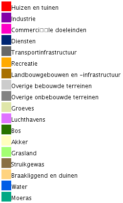
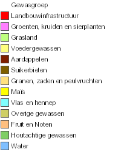

---
# generic options. See ?INBOmd::report() for full list and more details.
title: Afbakening van de open ruimte voor patrijs in functie van de jachtreglementering
author: 
  - firstname: Thierry
    name: Onkelinx
    email: "thierry.onkelinx@inbo.be"
    orcid: 0000-0002-1825-0097
  - firstname: Raïsa
    name: Carmen
    email: "raisa.carmen@inbo.be"
    orcid: 0000-0003-1025-8702
style: Vlaanderen
lang: nl

reviewer: 
  - firstname: Thomas
    name: Scheppers
    email: "thomas.scheppers@inbo.be"
    orcid: 0000-0002-5098-9326
year: 2022
reportnr: 2
depotnr: D/2022/3241/023
doi: 10.21436/inbor.70809860

# report specific options. See ?INBOmd::report() for full list and more details.
shortauthor: Onkelinx, T. & Carmen, R.
corresponding: thierry.onkelinx@inbo.be
cover_photo: https://img5.vildaphoto.net/asset/l/117545.jpg
cover_description: Roepende patrijs in maïsveld. © Yves Adams
cover: cover.pdf
cooperation:
  - Agentschap voor Natuur en Bos
  - VAC Brussel - Herman Teirlinck
  - Havenlaan 88 bus 75
  - 1000 Brussel
  - https://natuurenbos.be
cooperation_logo: anb.jpg


# pdf report specific options. See ?INBOmd::report() for full list and more details.
embargo: 2021-12-10

# HTML report specific options. See ?INBOmd::gitbook() for full list and more details.
github-repo: inbo/patrijs-steekproefkader

floatbarrier: section

bibliography: references.bib
link-citations: TRUE
site: bookdown::bookdown_site

output:
  INBOmd::gitbook: default
  INBOmd::pdf_report: default
  INBOmd::epub_book: default
  bookdown::dontrun: default
---

# Samenvatting {-}

**Waarom een open-ruimte-kaart?**

Het [Agentschap voor Natuur en Bos (ANB)](https://www.natuurenbos.be/) opent de jacht op patrijs in een wildbeheereenheid alleen wanneer aan meerdere voorwaarden voldaan is.
Een van deze voorwaarden is dat er genoeg patrijzen zijn.
Het ANB hanteert een minimum van 3 broedparen per 100 ha open ruimte.
Daarom moet een wildbeheereenheid (WBE) die op patrijs wil jagen, eerst inventariseren waar er allemaal patrijzen rondlopen.
Op basis van deze waarnemingen bepaalt het [Instituut voor Natuur- en Bosonderzoek (INBO)](https://www.vlaanderen.be/inbo/) het aantal broedparen in elke WBE.
Ten slotte delen we dit aantal broedparen door de oppervlakte open ruimte om tot de dichtheid van patrijs (broedparen per 100 ha open ruimte) te komen.
Om deze oppervlakte te kennen, hebben we nood aan een kaart die bepaalt wat open ruimte is.

**Waarom een nieuwe open-ruimte-kaart?**

Na de tellingen van het voorjaar 2021 lieten meerdere jagers ons weten dat de gebruikte open-ruimte-kaart niet altijd overeenkomt met de werkelijkheid.
Sommige percelen zijn aangeduid als open ruimte maar zijn in werkelijkheid bebouwd of bebost.
Waardoor de oppervlakte open ruimte overschat en de dichtheid van patrijs onderschat is.

De vorige versie van de open-ruimte-kaart is gebaseerd op de meest recente publicatie van de [biologische waarderingskaart (BWK)](https://www.vlaanderen.be/inbo/de-biologische-waarderingskaart/wat-is-de-biologische-waarderingskaart/).
Hoewel deze versie in 2020 gepubliceerd werd, wil dat niet zeggen dat alle informatie uit 2020 stamt.
In de praktijk bleek zowat driekwart van de gegevens ouder dan 2007.
Vandaar dat we op zoek gaan naar een betere bron.

**Een _open_ open-ruimte-kaart**

Na het afwegen van een aantal mogelijkheden, kozen we [OpenStreetMap](https://www.openstreetmap.org) als nieuwe bronkaart.
Net zoals alle andere kandidaten is deze kaart niet perfect, maar wel goed genoeg om te gebruiken.
En ze heeft als troef dat fouten relatief eenvoudig en snel te verbeteren zijn.
Bij de start van de inventarisatie krijgen de jagers een voorlopige versie van de open-ruimte-kaart.
Wanneer een jager een fout in de open-ruimte-kaart vaststelt, kan deze de fout melden of zelf aanpassen in OpenStreetMap.
Na het berekenen van het aantal broedparen kunnen we de finale versie van de open-ruimte-kaart vastleggen op basis van de meest recente informatie uit OpenStreetMap.

Dit is een belangrijk verschil met de overige onderzochte kaarten.
Die kan je namelijk niet bijwerken.
Verder zijn ze gebaseerd op informatie die minstens 1 tot 2 jaar oud is.

Voor de jagers biedt deze manier van werken de mogelijkheid om zelf bij te dragen aan een correcte open-ruimte-kaart.
Omdat OpenStreetMap de informatie met open gebruiksvoorwaarden aanbiedt, kan iedereen genieten van een verbeterde OpenStreetMap-kaart.

**Een [reproduceerbare](https://nl.wikipedia.org/wiki/Reproduceerbaarheid) open-ruimte-kaart**

In dit rapport beschrijven we hoe we de informatie van OpenStreetMap omzetten naar een open-ruimte-kaart.
De omzetting hebben we als een computerprogramma uitgewerkt.
We publiceren dit computerprogramma samen met de open-ruimte-kaart en de gebruikte bronkaarten (OpenStreetMap en grenzen jachtgebieden).
Op die manier kan iedereen de gebruikte regels (laten) nakijken of zelf uitvoeren.
```{r setup, include = FALSE}
library(knitr)
opts_chunk$set(
  echo = FALSE,
  eval = TRUE,
  cache = FALSE,
  warning = TRUE,
  error = FALSE,
  message = TRUE
)
library(tidyverse)
library(leaflet)
library(deldir)
library(INBOtheme)
if (interactive()) {
  theme_set(theme_inbo(base_size = 10))
} else {
  switch(
    opts_knit$get("rmarkdown.pandoc.to"),
    html = {
      opts_chunk$set(dev = "png", dpi = 72, fig.align = "center")
      theme_set(theme_inbo(base_size = 12))
    },
    latex = {
      opts_chunk$set(dev = "cairo_pdf", dpi = 300)
      theme_set(theme_inbo(base_size = 9))
      update_geom_defaults("point", list(size = 1.5))
      update_geom_defaults("text", list(size = 2))
    },
    epub3 = {
      opts_chunk$set(dev = "png", dpi = 300)
      theme_set(theme_inbo(base_size = 12))
    }
  )
}
```

<!--chapter:end:index.Rmd-->

\benglish <!-- spell-check: ignore -->

# English abstract {-}

**Why do we need an open space map?**

The [Agency for Nature and Forests (ANB)](https://www.natuurenbos.be/english) only allows the hunt for partridges in an area if several conditions are met.
One of these conditions is that there are enough partridges present.
For this, ANB applies a minimum of 3 breeding pairs per 100 ha of open space.
Therefore, a game management unit (GMU) that wishes to hunt partridge must first make an inventory of where all the partridges occur in the GMU.
Based on these observations, the [Research Institute for Nature and Forest (INBO)](https://www.vlaanderen.be/inbo/en-gb/homepage/) determines the number of breeding pairs in each GMU.
Finally we divide this number of breeding pairs by the area of open space to get the density of partridge (number of breeding pairs per 100 ha open space).
To obtain the area of open space in each GMU, we need a map that defines what open space is.

**Why a new open space map?**

After the spring 2021 censuses, several hunters informed us that the current open space map does not always correspond to reality.
Some plots were classified as open space on the map but are a built-up or forested area in reality.
This overestimated the area of open space and underestimated the density of partridge.
The previous version of the open space map is based on the most recent publication of the [biological valuation map (BVM)](https://www.vlaanderen.be/inbo/en-gb/biological-valuation-map/wat-is-de-biologische-waarderingskaart/).
Although this version of the BVM was published in 2020, it does not mean that all the information originated from 2020.
Actually, about three quarters of the information turned out to be older than 2007.
For that reason, we went looking for a better source.

**An _open_ open space map**

After weighing a number of options, we chose [OpenStreetMap](https://www.openstreetmap.org) as our source map.
Like all other candidates, this map is not perfect.
However, it is good enough to use.
And it has the advantage that errors are relatively easy and quickly corrected.
At the start of the surveys, hunters are given a preliminary version of the open space map.
When hunters identify errors in the open space map, they can report the error or modify it themselves in OpenStreetMap.
After calculating the number of breeding pairs, we can generate an updated version of the open space map based on the most recent information from OpenStreetMap.
This update ability is an important difference between OpenStreetMap and other usable maps.
Furthermore, the other maps are based on information that is at least 1 to 2 years old.

For hunters, this way of working provides them the opportunity to contribute to a correct open space map themselves.
Since OpenStreetMap provides the information with open use terms, everyone can enjoy an improved OpenStreetMap.

**A [reproducible](https://en.wikipedia.org/wiki/Reproducibility) open space map**

In this report, we describe how to convert the information from OpenStreetMap to an open space map.
We established the conversion as a computer program.
We publish that computer program together with the open space map and the source maps that were used (OpenStreetMap and hunting area boundaries).
In this way, everyone can check the rules (or have them checked), use, or implement them themselves.

\eenglish <!-- spell-check: ignore -->

<!-- hier komt de inhoudstafel bij pdf -->
\mainmatter <!-- spell-check: ignore -->

<!--chapter:end:00_abstract.Rmd-->

# Inleiding

Sinds 2008 is de jacht op patrijs in Vlaanderen gebonden aan een aantal voorwaarden.
De eerste voorwaarde vermeldt het voldoen aan een gemiddelde dichtheid van minstens 3 broedparen per 100 ha open ruimte.
Het Instituut voor Natuur- en Bosonderzoek (INBO) staat in voor de berekening van deze dichtheden en brengt hierover advies uit aan het Agentschap voor Natuur en Bos (ANB).

Aangezien de jachtwetgeving geen definitie geeft van de open ruimte, kozen we bij de invoering van deze regelgeving om te werken met de biologische waarderingskaart ([BWK](https://www.vlaanderen.be/inbo/de-biologische-waarderingskaart/bwk-belang/)).
De BWK is een gebiedsdekkende inventaris van het biologische milieu en van de bodembedekking van het volledige Vlaams Gewest.
Deze kaart wordt door het INBO opgemaakt aan de hand van een inventarisatie met behulp van vooraf gedefinieerde karteringseenheden.
De verschillende karteringseenheden werden beoordeeld als behorende tot de categorie "open ruimte" of "niet open ruimte" voor patrijs.
Op deze manier kon een afbakening van de open ruimte bepaald worden.

Voor de berekeningen van de dichtheden van de broedparen werd steeds gewerkt met de meest recente versie van de BWK.
Ook @Onkelinx2021 gebruikte de meest recente versie van de BWK [@BWK].
De verschillende versies verwijzen echter naar de kaart als geheel, niet naar de laatste update van elk polygoon in de kaart.
Zo stelt @BWK dat in de meest actuele versie ongeveer driekwart van de oppervlakte van het niet urbaan gebied gebaseerd is op een kartering van 2007 of ouder (fig. 1‐1 in @BWK).
Het gevolg is dat de BWK voor sommige gebieden niet langer het actuele landgebruik weergeeft.
Wat op zijn beurt weer aanleiding geeft tot fouten in de kaart met open ruimte relevant voor patrijs.

In het kader van de uitrol van een standaard telprotocol voor patrijs, werd daarom beslist om een alternatieve bepaling van de open ruimte voor patrijs uit te werken.
Gezien de hoeveelheid vragen en opmerkingen over de vorige kaart, willen we de nieuwe kaart tevens transparant, open en reproduceerbaar maken.
Elke betrokkene kan hierdoor de werkwijze (laten) nakijken of zelf opnieuw (laten) uitvoeren.
Om dit te kunnen garanderen, gebruiken we enkel kaartmateriaal dat als [open data](https://nl.wikipedia.org/wiki/Open_data) beschikbaar is en [vrije software](https://nl.wikipedia.org/wiki/Vrije_software_en_opensourcesoftware).
In dit rapport beschreven we welke alternatieve kaarten we in overweging genomen hebben.
Vervolgens beschrijven we op welke manier we de nieuwe open-ruimte-kaart uitwerken.

<!--chapter:end:01_inleiding.Rmd-->

# Op zoek naar alternatieve kaartlagen

De belangrijkste voorwaarde is een kaartlaag die bruikbare informatie levert om te bepalen wat open ruimte voor de patrijs is en wat niet.

Een belangrijke randvoorwaarde die we stellen is dat de kaartlaag als open data beschikbaar moet zijn.
Verder willen we een kaart die voldoende recent is en regelmatig zal bijgewerkt worden in de toekomst.
Anders lopen we binnen een paar jaar terug tegen het probleem aan waar we met de eerste kaart mee kampten, namelijk verouderd kaartmateriaal.

Om het verschil tussen de verschillende kaartlagen zichtbaar te maken tonen we telkens een kaart van hetzelfde gebied in Vlaanderen.
Figuur \@ref(fig:basis) toont de meest recente luchtfoto's van dit gebied.
We selecteerden dit gebied omdat het een inzicht geeft in de verschillen tussen de kaartlagen.
In de online versie van dit rapport zijn de kaarten interactief.
Daar kan de lezer de kaart verplaatsen naar een gebied naar eigen keuze.
De lezer kan in de online eveneens de laag met de jachtterreinen activeren.

```{r basis, fig.cap = "Basiskaart met de meest recente luchtfoto's."}
basis <- leaflet(width = "100%", height = "770") %>%
  # setView(lat = 51.05936, lng = 4.80056, zoom = 16) %>%
  setView(lat = 50.75695, lng = 4.00905, zoom = 15) %>%
  addWMSTiles(
    paste(
      "https://geoservices.informatievlaanderen.be", "raadpleegdiensten",
      "OMWRGBMRVL", "wms",
      sep = "/"
    ),
    layers = "Ortho", group = "orthofoto",
    options = WMSTileOptions(
      format = paste("image", "png", sep = "/"), transparent = TRUE
    ),
    attribution = paste(
      "AIV <a href='https://overheid.vlaanderen.be", "sites", "default",
      "files", "documenten", "ict-egov", "licenties", "hergebruik",
      "modellicentie_gratis_hergebruik_v1_0.html'>Gratis hergebruik</a>",
      sep = "/"
    )
  ) %>%
  addWMSTiles(
    paste(
      "https://geoservices.informatievlaanderen.be", "raadpleegdiensten",
      "Jacht", "wms",
      sep = "/"
    ),
    layers = "Jachtterr", group = "jachtterreinen",
    options = WMSTileOptions(
      format = paste("image", "png", sep = "/"), transparent = TRUE
    ),
    attribution = paste(
      "AIV <a href='https://overheid.vlaanderen.be", "sites", "default",
      "files", "documenten", "ict-egov", "licenties", "hergebruik",
      "modellicentie_gratis_hergebruik_v1_0.html'>Gratis hergebruik</a>",
      sep = "/"
    )
  )
basis %>%
  addLayersControl(
    baseGroups = "orthofoto", overlayGroups = "jachtterreinen",
    options = layersControlOptions(collapsed = FALSE)
  ) %>%
  hideGroup("jachtterreinen")
```

## Groenkaart {#s:groenkaart}

Bron: https://www.geopunt.be/catalogus/datasetfolder/2c64ca0c-5053-4a66-afac-24d69b1a09e7

De meest recente versie geeft het landgebruik voor 2018 weer.
In principe zal men de kaart elke drie jaar vernieuwen.
De kaart is beschikbaar onder de [modellicentie gratis hergebruik](https://overheid.vlaanderen.be/sites/default/files/documenten/ict-egov/licenties/hergebruik/modellicentie_gratis_hergebruik_v1_0.html).
Het betreft een rasterkaart met resolutie van 1 x 1 m gebaseerd op zomerluchtfoto's.

Een segmentatiealgoritme deelt de rastercellen op in vier klassen: "landbouw", "laag groen", "hoog groen" en "niet groen".
De klasse "laag groen" maakt deze laag minder geschikt als bron.
Ze omvat zowel relevante gebieden (graslanden) als niet relevante gebieden (tuinen, jonge bossen, ...).
Daarnaast is deze kaart niet foutenvrij doordat het segmentatiealgoritme de luchtfoto's niet steeds correct interpreteert.
Zo werden verschillende akkers waar op het moment van de foto veel plassen op stonden foutief geklasseerd als "niet groen".

(ref:groenkaart) Groenkaart versie 2018. De legende is beschikbaar in fig. \@ref(fig:groenkaart-legende).

```{r groenkaart, fig.cap = "(ref:groenkaart)"}
basis %>%
  addWMSTiles(
    paste(
      "https://geoservices.informatievlaanderen.be", "raadpleegdiensten",
      "ANB", "wms",
      sep = "/"
    ),
    layers = "Grnkrt18", group = "groenkaart",
    options = WMSTileOptions(
      format = paste("image", "png", sep = "/"), transparent = TRUE
    ),
    attribution = paste(
      "ANB <a href='https://overheid.vlaanderen.be", "sites", "default",
      "files", "documenten", "ict-egov", "licenties", "hergebruik",
      "modellicentie_gratis_hergebruik_v1_0.html'>Gratis hergebruik</a>",
      sep = "/"
    )
  ) %>%
  addLayersControl(
    baseGroups = c("groenkaart", "orthofoto"), overlayGroups = "jachtterreinen",
    options = layersControlOptions(collapsed = FALSE)
  ) %>%
  hideGroup("jachtterreinen")
```

```{r groenkaart-legende, fig.cap = "Legende van de groenkaart."}

```

## Landgebruik {#s:landgebruik}

Bron: https://www.geopunt.be/catalogus/datasetfolder/fe979929-a2b5-4353-94c5-608c4b109dc6

De meest recente versie geeft het landgebruik voor 2019 weer.
In principe zal men de kaart elke drie jaar vernieuwen.
De kaart is beschikbaar onder de [modellicentie gratis hergebruik](https://overheid.vlaanderen.be/sites/default/files/documenten/ict-egov/licenties/hergebruik/modellicentie_gratis_hergebruik_v1_0.html).
Het betreft een rasterkaart met resolutie van 10 x 10 m bekomen door meerdere databronnen met elkaar te combineren [@landgebruik].

Deze kaart omvat 18 klassen van landgebruik.
Relevant voor patrijs zijn "akker" en "grasland".
Tuinen zitten in een afzonderlijke categorie "huizen en tuinen".
Boomgaarden zijn een mengeling van "akker", "grasland" en "bos" met variabele verhoudingen.
Grasland dicht bij gebouwen is regelmatig als "overige onbebouwde terreinen" of "overige bebouwde terreinen" ingedeeld.
Plantenkwekerijen zijn meestal als "akker" opgenomen.

(ref:landgebruik) Landgebruik versie 2019. De legende is beschikbaar in fig. \@ref(fig:landgebruik-legende).

```{r landgebruik, fig.cap = "(ref:landgebruik)"}
basis %>%
  addWMSTiles(
    "https://www.mercator.vlaanderen.be/raadpleegdienstenmercatorpubliek/wms",
    layers = "lu:lu_landgebruik_vlaa_2019", group = "landgebruik",
    options = WMSTileOptions(
      format = paste("image", "png", sep = "/"), transparent = TRUE
    ),
    attribution = paste(
      "ALV <a href='https://overheid.vlaanderen.be", "sites", "default",
      "files", "documenten", "ict-egov", "licenties", "hergebruik",
      "modellicentie_gratis_hergebruik_v1_0.html'>Gratis hergebruik</a>",
      sep = "/"
    )
  ) %>%
  addLayersControl(
    baseGroups = c("landgebruik", "orthofoto"),
    overlayGroups = "jachtterreinen",
    options = layersControlOptions(collapsed = FALSE)
  ) %>%
  hideGroup("jachtterreinen")
```

```{r landgebruik-legende, fig.cap = "Legende van de landgebruikkaart."}

```

## Landbouwgebruikspercelen {#s:landbouw}

Bron: https://www.geopunt.be/catalogus/datasetfolder/13cc8a4e-7292-4cb8-afc7-6e07d052b01a

De meest recente versie geeft de situatie van 2020 weer.
In principe zal men de kaart jaarlijks vernieuwen.
De kaart is beschikbaar onder de [modellicentie gratis hergebruik](https://overheid.vlaanderen.be/sites/default/files/documenten/ict-egov/licenties/hergebruik/modellicentie_gratis_hergebruik_v1_0.html).
Het betreft een vectoriële polygonenkaart gebaseerd op de perceelsaangifte van de [verzamelaanvragen](https://lv.vlaanderen.be/nl/landbouwbeleid/landbouwbeleid-eu/gemeenschappelijk-landbouwbeleid-glb-2020/informatiefiches) van de [landbouwers](https://lv.vlaanderen.be/nl/bedrijfsvoering/verzamelaanvraag-randvoorwaarden/verzamelaanvraag/algemene-voorwaarden#waarvoor%20dient%20VA).

De kaart bevat voor elk perceel de gewasgroep en de hoofdteelt.
Op basis van deze informatie kunnen we open ruimte definiëren.
Het belangrijkste nadeel aan deze kaart is dat we enkel de open ruimte kennen voor de percelen in professioneel landbouwgebruik.
We missen de open ruimte ingenomen door hobbyboeren, paardenhouders, natuurgebieden, ...

(ref:landbouw) Gewasgroepen volgens de landbouwgebruikspercelen versie 2020. De legende is beschikbaar in fig. \@ref(fig:landbouw-legende).

```{r landbouw, fig.cap = "(ref:landbouw)"}
basis %>%
  addWMSTiles(
    paste(
      "https://geoservices.informatievlaanderen.be", "raadpleegdiensten",
      "ALV", "wms",
      sep = "/"
    ),
    layers = "LbGebrPerc2020", group = "landbouw",
    options = WMSTileOptions(
      format = paste("image", "png", sep = "/"), transparent = TRUE
    ),
    attribution = paste(
      "ALV <a href='https://overheid.vlaanderen.be", "sites", "default",
      "files", "documenten", "ict-egov", "licenties", "hergebruik",
      "modellicentie_gratis_hergebruik_v1_0.html'>Gratis hergebruik</a>",
      sep = "/"
    )
  ) %>%
  addLayersControl(
    baseGroups = "orthofoto", overlayGroups = c("landbouw", "jachtterreinen"),
    options = layersControlOptions(collapsed = FALSE)
  ) %>%
  hideGroup("jachtterreinen")
```

```{r landbouw-legende, fig.cap = "Legende van de gewasgroepen van de landbouwgebruikspercelenkaart."}

```

## OpenStreetMap {#s:osm}

Bron: https://www.openstreetmap.org

OpenStreetMap is een kaart waar wereldwijd vrijwilligers aan bijdragen.
Het updaten van de kaart hangt bijgevolg af van de vrijwilligers.
De databank bevat de geschiedenis van alle objecten.
De meest recente toestand van elke locatie is beschikbaar als een vectoriële [polygonenkaartlaag](https://download.geofabrik.de/europe/belgium.html).
Ze bieden de informatie tevens aan als verschillende kant en klaar [online kaarten](https://wiki.openstreetmap.org/wiki/NL:Using_OpenStreetMap#Kant_en_klare_online_kaarten).
De kaart is beschikbaar onder de [`Open Database License`](https://wiki.openstreetmap.org/wiki/NL:Open_Database_License).

Elke polygoon bevat informatie in een gestandaardiseerd formaat.
Naast landgebruik kan er informatie zijn over gebouwen, administratieve gebieden, ...
We kunnen de open ruimte definiëren aan de hand van de polygonen die voldoen aan een goed gekozen set van kenmerken.

Grosso modo is de actuele kwaliteit van deze kaart behoorlijk goed.
Ze is niet perfect.
Deels omdat ze op sommige plaatsen verouderd is.
Deels omdat vrijwilligers zich soms vergissen van landgebruiksklasse of een gebied niet (helemaal) ingetekend hebben.

(ref:osm) Voorbeeld van OpenStreetMap. De legende is beschikbaar via https://wiki.openstreetmap.org/wiki/AreasTab.

```{r osm, fig.cap = "(ref:osm)"}
basis %>%
  addTiles(group = "OSM") %>%
  addLayersControl(
    baseGroups = c("OSM", "orthofoto"), overlayGroups = "jachtterreinen",
    options = layersControlOptions(collapsed = FALSE)
  ) %>%
  hideGroup("jachtterreinen")
```


# Keuze van de basiskaartlaag

Geen enkele van de kaarten uit het vorige hoofdstuk is de perfecte oplossing waar we naar op zoek zijn.
Elk van de kaarten heeft zijn voor- en nadelen.
De groenkaart (§\@ref(s:groenkaart)) en de landsgebruikskaart (§\@ref(s:landgebruik)) hebben een te ruwe opdeling in klassen.
De landbouwgebruikspercelen (§\@ref(s:landbouw)) is een goede kaart, doch enkel voor de percelen in professioneel landbouwgebruik.
We missen met deze kaart de open ruimte die niet in professioneel landbouwgebruik is.
Een bijkomend nadeel van deze kaarten is dat ze een of meerdere jaren achterop hinken (tijd tussen de vaststelling van het landgebruik en de publicatie van de kaart).

Daarom kiezen we voor OpenStreetMap.
De huidige kwaliteit van deze kaartlaag is voldoende als een startpunt.
Ze heeft een voldoende fijne indeling in klassen.
Ze is gebiedsdekkend zodat we ook informatie hebben over de gebieden die niet door de landbouw in gebruik zijn.
Daarnaast biedt deze kaart als enige het voordeel dat ze relatief eenvoudig bij te werken valt.
Aanpassingen in de OpenStreetMap databank zijn bovendien een paar dagen later beschikbaar in de afgeleide producten.
Dit laat ons toe om voor de start van de tellingen van de voorjaarsstand van patrijs een versie van de open-ruimte-kaart te publiceren die gebaseerd is op een recente versie van OpenStreetMap.
Tijdens de tellingen van de voorjaarsstand van patrijs kunnen jagers in het veld controleren hoe accuraat deze kaart is.
Afwijkingen te wijten aan fouten in OpenStreetMap kunnen ze dan melden aan OpenStreetMap of zelf (laten) corrigeren.
Na de tellingen van de voorjaarsstand van patrijs maken we een nieuwe versie van de open-ruimte-kaart aan.
Ook nu baseren we ons op de meest recente informatie uit OpenStreetMap.
Op die manier stromen verbeteringen in OpenStreetMap door naar de open-ruimte-kaart.
En zo houden we bij het bepalen van de gemiddelde dichtheid van patrijs in de WBE rekening met de meest recent beschikbare informatie.

In het volgende hoofdstuk beschrijven we welke selecties we uitvoeren op basis van OpenStreetMap om de open-ruimte-kaart aan te maken.
Iedereen kan op basis van deze regels vaststellen waarom we een bepaald perceel al dan niet als open ruimte indelen.
De eigenschappen van een polygoon kan je op https://www.openstreetmap.org eenvoudig opvragen via "Nabije objecten opvragen".
Hiervoor selecteer je rechts de tool die als icoon een pijltje met vraagteken heeft.
De cursor verandert dan in een vraagteken met pijl naar beneden.
Daarmee klik je in het gebied waarvan je de informatie wenst op te vragen.
Vervolgens krijg je een lijst van "Omsluitende objecten".
Klik op het relevante object om alle informatie te raadplegen.
Naast de informatie over de labels krijg je eveneens te zien welke gebruiker de laatste aanpassing uitvoerde en wanneer.

Heb je een fout in de kaart gezien?
Dan kan je eenvoudig een opmerking maken bij de kaart.
Hiervoor selecteer je rechts de tool die als icoon een tekstballon met plusteken heeft.
Sleep de pin naar de relevante locatie en voeg jouw opmerking toe.
Eventuele bestaande opmerkingen in de omgeving zullen nu zichtbaar worden.
Vrijwilligers kunnen aan de slag gaan met deze opmerkingen om de kaart te verbeteren.

Wil je zeker zijn dat de fout verbetert raakt, dan kan je ze [zelf](https://wiki.openstreetmap.org/wiki/NL:Beginnershandleiding) verbeteren.
Het enige wat je nodig hebt is een gratis [account](https://wiki.openstreetmap.org/wiki/NL:Beginners_Guide_1.0).
Eens ingelogd kan je de kaart bewerken.
Dit omvat zowel het correct plaatsen van grenzen als het bijwerken van informatie.

<!--chapter:end:1_alternatief.Rmd-->

# Selectie van relevante gebieden uit OpenStreetMap {#s-relevant}

In dit hoofdstuk geven we aan welke kenmerken we uit [OpenStreetMap](https://www.openstreetmap.org) gebruiken om de voor patrijs relevante open ruimte te definiëren.
We gebruiken hiervoor de kenmerken [`landuse`](https://wiki.openstreetmap.org/wiki/NL:Key:landuse) (landgebruik), [`natural`](https://wiki.openstreetmap.org/wiki/NL:Key:natural) (natuurlijk landschap) en [`landcover`](https://wiki.openstreetmap.org/w/index.php?title=Key:landcover&redirect=no) (bodembedekking).
De links in voorgaande zin verwijzen naar de volledige lijst van mogelijke klassen.
Door deze lijst te vergelijken met onderstaande sectie weet de lezer welke klassen we niet gebruiken bij de selectie.

## Positieve selectie

We selecteren alle gebieden die voldoen aan een van de onderstaande kenmerken.
Om de kaart zo compact mogelijk te maken voegen we aangrenzende polygonen samen tot een geheel.
Daarnaast snijden we ze bij tot de jachtterreinen.
Het resultaat van deze kaart is een maximale kaart van de open ruimte binnen de Vlaamse jachtterreinen.

### Akker

- OSM definitie: `landuse = farmland`
- Objecttype: landbouwgebied
- OSM Wiki: https://wiki.openstreetmap.org/wiki/Tag:landuse%3Dfarmland

### Weiland of grasland in landbouwbeheer

- OSM definitie: `landuse = meadow`
- Objecttype: weide
- OSM Wiki: https://wiki.openstreetmap.org/wiki/Tag:landuse%3Dmeadow

### Natuurlijk grasland

- OSM definitie: `natural = grassland`
- Objecttype: natuurlijk grasland
- OSM Wiki: https://wiki.openstreetmap.org/wiki/Tag:natural%3Dgrassland

### Drassig weiland of moeras

- OSM definitie: `natural = wetland`
- Objecttype: natuurlijk grasland
- OSM Wiki: https://wiki.openstreetmap.org/wiki/Tag:natural%3Dwetland

We gebruiken enkel gebieden die ofwel expliciet als drassig weiland (`wetland = wet_meadow`) aangeduid zijn, ofwel geen
bijkomende aanduiding hebben (geen `wetland = ...`).
Categorieën die we buiten beschouwing laten zijn:

- moeras (`wetland = swamp` of `wetland = marsh`)
- rietveld (`wetland = reedbed`)
- ven (`wetland = fen`)
- veen (`wetland = bog`)
- slik (`wetland = tidalflat`)
- schorre (`wetland = saltmarsh`)

Is dit landgebruik wel relevant voor patrijs?
Wanneer we deze gebieden vergelijken met de biologische waarderingskaart [@BWK], stellen we vast dat het merendeel van de percelen een BWK code bevatten die we vorige jaar als open ruimte beschouwden.
We kunnen ze eveneens vergelijken met de waarnemingen van de tellingen van patrijs uit het voorjaar van 2021.
Als er in de onmiddellijke omgeving waarnemingen van patrijs zijn, dan zijn er meestal ook waarnemingen van patrijs in deze gebieden.
Merk op dat deze set zowel percelen omvat die expliciet als drassig weiland aangeduid zijn en andere percelen waarbij het type `wetland` niet gespecificeerd is.
Deze laatste groep kan een aantal percelen bevatten die in de praktijk geen drassig weiland maar moeras, rietveld, ... zijn.
In dat geval zijn ze ten onrechte opgenomen in de open ruimte.
Wanneer dit in OpenStreetMap gecorrigeerd is, zullen dergelijke percelen bij de volgende versie van de open-ruimte-kaart automatisch uit de selectie gehaald worden.

### Particuliere weides

Soms gebruikt om kleinere weides met paarden, schapen, ... aan te duiden.

- OSM definitie: `landuse = animal_keeping`
- Objecttype: _niet beschikbaar_
- OSM Wiki: https://wiki.openstreetmap.org/wiki/Tag:landuse%3Danimal_keeping

### Overige gras

- OSM definitie: `landuse = grass` of `landcover = grass`
- Objecttype: gras
- OSM Wiki: https://wiki.openstreetmap.org/wiki/Tag:landcover%3Dgrass en https://wiki.openstreetmap.org/wiki/Tag:landuse%3Dgrass

### Boomgaard

- OSM definitie: `landuse = orchard`
- Objecttype: boomgaard
- OSM Wiki: https://wiki.openstreetmap.org/wiki/Tag:landuse%3Dorchard

Een combinatie van weide met (hoogstam)boomgaard is `landuse = meadow, meadow = orchard`.

### Wijngaard

- OSM definitie: `landuse = vineyard`
- Objecttype: wijngaard
- OSM Wiki: https://wiki.openstreetmap.org/wiki/Tag:landuse%3Dvineyard

## Negatieve selectie

Soms zijn er in OpenStreetMap grote gebieden als één landgebruik aangeduid en komen daarbinnen kleinere gebieden met een ander landgebruik voor.
Bijvoorbeeld een groot bosgebied met hier en daar een weiland.
Of een groot akkergebied met hier en daar een klein bos.
Wanneer we enkel met een positieve selectie werken dan krijgen we enkel bij het eerste voorbeeld een correcte selectie (enkel het weiland).
In het tweede voorbeeld selecteren we teveel (de bossen die overlappen met het akkergebied).

Daarom we knippen we onderstaande landgebruiken uit de maximale kaart met open ruimte.
We doen dit enkel wanneer het gaat om kleine (negatieve) gebieden die volledig binnen een groot (positief) gebied liggen.

### Woongebied

- OSM definitie: `landuse = residential`
- Objecttype: woongebied
- OSM Wiki: https://wiki.openstreetmap.org/wiki/Tag:landuse%3Dresidential

### Boerenerf

- OSM definitie: `landuse = farmyard`
- Objecttype: boerenerf
- OSM Wiki: https://wiki.openstreetmap.org/wiki/Tag:landuse%3Dfarmyard

### Beheerd bos

- OSM definitie: `landuse = forest`
- Objecttype: beheerd bos
- OSM Wiki: https://wiki.openstreetmap.org/wiki/Tag:landuse%3Dforest

### Natuurlijk bos

- OSM definitie: `natural = wood`
- Objecttype: natuurlijk bos
- OSM Wiki: https://wiki.openstreetmap.org/wiki/Tag:natural%3Dwood

### Industrie

- OSM definitie: `landuse = industrial`
- Objecttype: industriegebied
- OSM Wiki: https://wiki.openstreetmap.org/wiki/Tag:landuse%3Dindustrial

<!--chapter:end:2_relevant.Rmd-->

# Opdelen van open ruimte in telblokken

De wildbeheereenheden die wensen te jagen op patrijs, dienen de patrijzen te monitoren binnen de open ruimte in hun werkingsgebied.
Volgens @telprotocol kan een teller een gebied van 125 tot 175 ha inventariseren.
Daarom delen we de open ruimte van de WBE op in een meerdere telblokken.
Hierbij streven we naar telblokken die hoogstens 150 ha open ruimte bevatten.
Vanuit de jagerij kwam het signaal dat ze verkiezen om geen telblokken te hebben die meerdere jachtterreinen omvatten.
Aangezien sommige jachtterreinen weinig open ruimte bevatten zullen sommige telblokken hierdoor klein zijn.
Het is de bedoeling dat we van elk telblok een kaart maken die afdrukbaar is op een A4 bij schaal 1:10.000.
Daarom moet elk telblok passen binnen een begrenzingsvak met een lange zijde van maximum 2500 m en korte zijde van maximum 1900 m.

In een eerste stap gaan we na voor welke jachtterreinen de open ruimte kleiner dan 150 ha is en het geheel een begrenzingsvlak heeft dat voldoende klein is.
Voor deze jachtterrein is de volledige open ruimte binnen het jachtterrein het telblok.

Bij de grotere jachtterreinen zullen we eerste de open ruimte in kleinere eenheden splitsen.
Eerst relatief kleine eenheden maken en die nadien samenvoegen tot telblokken, laat toe een zo goed mogelijke indeling te maken.
Daarom streven we in deze fase naar eenheden kleiner dan 50 ha en met een begrenzingsvak van minder dan 1900 m langs elke zijde.
In eerste instantie kijken we naar de reeds bestaande eenheden binnen een jachtterrein.
Deze eenheden zijn volledig van elkaar gescheiden door delen die geen open ruimte of geen jachtgebied zijn.
Eenheden die reeds voldoende klein zijn (< 150 ha en begrenzingsvak < 1900 m langs elke zijde) zetten we apart.

Grotere eenheden proberen we in kleinere eenheden te splitsen langs grenzen die in het veld duidelijk zichtbaar zijn.
Hiervoor gebruiken we de beschikbare informatie over wegen ([`highway`](https://wiki.openstreetmap.org/wiki/Key:highway)) en waterlopen ([`waterway`](https://wiki.openstreetmap.org/wiki/Key:waterway)) uit OpenStreetMap.
Tabel \@ref(tab:indeling) toont welke elementen we gebruiken en in welke volgorde.
We starten met de belangrijkste elementen die er toe doen.
Vandaar dat we eerst splitsen langs steenwegen en dan langs lokale verbindingswegen.
Splitsen langs belangrijkere wegen zoals snelwegen is niet relevant aangezien er geen eenheden zijn waar een snelweg doorloopt.
Na elke split zetten we de eenheden die nu voldoende klein zijn apart.
De overige eenheden splitsen we met het volgende element.
Wanneer we alle elementen van tabel \@ref(tab:indeling) afgewerkt hebben blijven er nog een paar grote eenheden over.
Mogelijk zijn in deze gebieden nog niet alle elementen toegevoegd aan OpenStreetMap.
Een andere mogelijkheid is dat er in het gebied geen elementen aanwezig zijn die de eenheid doorsnijden.
We kunnen niet anders dan deze eenheden als telblokken groter dan 150 ha te gebruiken.

```{r indeling}
tribble(
  ~key, ~value, ~omschrijving, ~url,
  "highway", "secondary", "steenwegen",
    "https://wiki.openstreetmap.org/wiki/Tag:highway%3Dsecondary",
  "highway", "tertiary", "lokale verbindingswegen",
    "https://wiki.openstreetmap.org/wiki/Tag:highway%3Dtertiary",
  "waterway", "stream", "beek",
    "https://wiki.openstreetmap.org/wiki/Tag:waterway%3Dstream",
  "highway", "unclassified", "lokale wegen",
    "https://wiki.openstreetmap.org/wiki/Tag:highway%3Dunclassified",
  "highway", "track", "veldweg geschikt voor landbouwvoertuigen",
    "https://wiki.openstreetmap.org/wiki/Tag:highway%3Dtrack",
  "waterway", "ditch", "gracht",
    "https://wiki.openstreetmap.org/wiki/Tag:waterway%3Dditch",
  "waterway", "ditch", "afwateringskanaal",
    "https://wiki.openstreetmap.org/wiki/Tag:waterway%3Ddrain",
  "highway", "path", "veldweg niet geschikt voor landbouwvoertuigen",
    "https://wiki.openstreetmap.org/wiki/Tag:highway%3Dtrack",
  "highway", "service", "private toegangsweg",
    "https://wiki.openstreetmap.org/wiki/Tag:highway%3Dservice"
) %>%
  transmute(
    .data$key, value = sprintf("[%s](%s)", .data$value, .data$url),
    .data$omschrijving
  ) %>%
  kable(
    caption = "Gebruikte informatie uit OpenStreetMap om te grote eenheden
      stapsgewijs te verkleinen, in volgorde van gebruik.",
    escape = FALSE, format = "simple"
  )
```

Nu we de open ruimte in kleinere eenheden opgedeeld hebben, komen we in de fase dat we deze eenheden terug samenvoegen tot telblokken.
We kijken per jachtterrein welke eenheden vlak bij elkaar liggen.
In figuur \@ref(fig:samen-1) geven we een fictief voorbeeld van een aantal eenheden in een jachtgebied.

```{r samen-1, fig.cap = "Voorbeeld met een aantal fictieve eenheden met aanduiding van hun zwaartepunt, label en oppervlakte."}
tribble(
  ~x, ~y, ~id, ~opp,
     0, -20, "A", 20,
     0, 500, "B", 35,
   400, -50, "C", 10,
   500, 400, "D", 12,
  1500, 200, "E", 50,
  1000, 1200, "F", 150
) %>%
  mutate(
    delta = sqrt(.data$opp) * 50,
    label = sprintf("%s (%iha)", .data$id, .data$opp),
    x_min = .data$x - .data$delta,
    x_max = .data$x + .data$delta,
    y_min = .data$y - .data$delta,
    y_max = .data$y + .data$delta
  ) -> punten
bind_rows(
  select(punten, x = .data$x_min, y = .data$y_min, .data$id),
  select(punten, x = .data$x_min, y = .data$y_max, .data$id),
  select(punten, x = .data$x_max, y = .data$y_max, .data$id),
  select(punten, x = .data$x_max, y = .data$y_min, .data$id)
) -> vlakken
ggplot(punten, aes(x = x, y = y)) +
  geom_polygon(data = vlakken, aes(group = id), fill = NA) +
  geom_point() +
  geom_text(aes(label = label), hjust = 0.5, vjust = -0.5) +
  theme_void() +
  coord_equal()
```

Om dit te kunnen automatiseren bepalen we eerst van elke eenheid zijn [zwaartepunt](https://nl.wikipedia.org/wiki/Zwaartepunt) (zwaartepunt).
Vervolgens berekenen we een [Delaunay-triangulatie](https://nl.wikipedia.org/wiki/Delaunay-triangulatie) van deze zwaartepunten.
Op deze manier verbinden we twee zwaartepunten zodat een set van niet overlappende driehoeken ontstaat.
We veronderstellen dat, wanneer het zwaartepunt van twee eenheden met elkaar verbonden is, deze eenheden naast elkaar liggen zonder dat er een andere eenheid tussen ligt.
Wanneer deze eenheden gescheiden zijn door iets wat geen open ruimte is (bos, dorpskern, ...) kan het zijn dat ze alsnog ver uit elkaar liggen.
Daarom beperken we ons tot de verbonden zwaartepunten die minder dan 1 km uit elkaar liggen.
In figuur \@ref(fig:samen-2) tonen we de Delaunay-triangulatie toegepast op het voorbeeld uit fig. \@ref(fig:samen-1).
Merk op dat eenheid `E` te ver van de andere eenheden ligt.
We verbreken ook verbindingen met eenheden die reeds te groot zijn.
In het voorbeeld is dat `F`.

```{r samen-2, fig.cap = "Toevoegen van Delaunay-triangulatie met aanduiding van de afstand tussen de zwaartepunten."}
punten %>%
  select(.data$x, .data$y) %>%
  as.matrix() %>%
  deldir() %>%
  `[[`("delsgs") %>%
  mutate(
    afstand = sqrt((x1 - x2) ^ 2 + (y1 - y2) ^ 2),
    dichtbij = ifelse(afstand <= 1000, "ja", "nee"),
    label = sprintf("%.0fm", .data$afstand),
    x = (x1 + x2) / 2,
    y = (y1 + y2) / 2,
    hoek = ifelse(
      .data$x1 < .data$x2,
      atan2(.data$y2 - .data$y1, .data$x2 - .data$x1),
      atan2(.data$y1 - .data$y2, .data$x1 - .data$x2)
    ) %>%
      `*`(180 / pi)
  ) -> segment
ggplot(punten, aes(x = x, y = y)) +
  geom_polygon(data = vlakken, aes(group = id), fill = NA) +
  geom_segment(
    data = segment,
    aes(x = x1, xend = x2, y = y1, yend = y2, colour = dichtbij),
  ) +
  geom_point() +
  geom_text(aes(label = id), hjust = -0.3, vjust = -0.3) +
  geom_text(
    data = segment, vjust = -0.2, show.legend = FALSE,
    aes(label = label, angle = hoek, colour = dichtbij)
  ) +
  theme_void() +
  coord_equal()
```

We willen zoveel mogelijk kleine telblokken vermijden.
Dat kunnen we door te kijken bij welke eenheden we de kleinste eenheid kunnen samenvoegen.
We kijken met welke eenheden de kleinste eenheid verbonden is.
In ons voorbeeld is `C` de kleinste eenheid en deze is verbonden met `A` en `D`.
De vraag is nu welke groep het meest compacte resultaat geeft.
We vatten de compactheid van een groep van $N$ eenheden in formule \@ref(eq:penalty).
Hierbij is $O_i$ de oppervlakte van de eenheid $i$ in ha, $L_i$ de langste zijde en $K_i$ de kortste zijde van het begrenzingsvak.
Hoe kleiner de waarde van $O_i$, $L_i$ en $K_i$, hoe compacter het telblok $i$ is.
De globale maat $P$ hangt enerzijds af van het aantal telblokken en anderzijds van hun compactheid.
Een lage $P$ is een goede balans tussen zo weinig mogelijk telblokken en compacte telblokken.
In tabel \@ref(tab:compact-eenheid) geven we deze maten voor elke eenheid of groep van eenheden.
(Groepen van) eenheden die niet voldoen aan de voorwaarden $O_i < 150$, $L_i < 2500$ en $K_i < 1900$ zijn te groot en gebruiken we niet.

<!-- spell-check: ignore:start -->
\begin{equation}
  P = \sum^N_{i=1} \left(\frac{O_i}{150} + \frac{L_i}{2500} + \frac{K_i}{1900}\right)
  (\#eq:penalty)
\end{equation}
<!-- spell-check: ignore:end -->

```{r compact-eenheid}
tribble(
  ~groep, ~id,
  "AC", "A", "AC", "C",
  "CD", "C", "CD", "D",
  "ACD", "A", "ACD", "C", "ACD", "D",
  "BD", "B", "BD", "D",
  "ABCD", "A", "ABCD", "B", "ABCD", "C", "ABCD", "D"
) %>%
  inner_join(punten, by = "id") %>%
  bind_rows(
    punten %>%
      filter(.data$id != "F") %>%
      mutate(groep = .data$id)
  ) %>%
  group_by(.data$groep) %>%
  summarise(
    opp = sum(.data$opp),
    x_min = min(.data$x_min),
    x_max = min(.data$x_max),
    y_min = min(.data$y_min),
    y_max = min(.data$y_max)
  ) %>%
  transmute(
    .data$groep, O = .data$opp,
    L = pmax(.data$x_max - .data$x_min, .data$y_max - .data$y_min),
    K = pmin(.data$x_max - .data$x_min, .data$y_max - .data$y_min),
    P = .data$O / 150 + .data$L / 2500 + .data$K / 1900
  ) -> penalty
penalty %>%
  arrange(.data$O) %>%
  rename_with(.cols = -.data$groep, .fn = sprintf, fmt = "$%s_i$") %>%
  kable(
    digits = c(0, 0, 0, 0, 2), escape = FALSE,
    caption = "Compactheidmaten per eenheid of groep van eenheden."
  )
```

```{r compact}
tribble(
  ~combinatie, ~groep,
  "A, B, C, D, E", list(c("A", "B", "C", "D", "E")),
  "AC, B, D, E", list(c("AC", "B", "D", "E")),
  "A, B, CD, E", list(c("A", "B", "CD", "E")),
  "ACD, B, E", list(c("ACD", "B", "E")),
  "AC, BD, E", list(c("AC", "BD", "E")),
  "ACBD, E", list(c("ABCD", "E"))
) %>%
  unnest(.data$groep) %>%
  unnest(.data$groep) %>%
  inner_join(penalty, by = "groep") %>%
  group_by(.data$combinatie) %>%
  summarise(P = sum(.data$P)) %>%
  arrange(desc(.data$P)) %>%
  kable(
    caption =
  "Compactheidscore voor verschillende combinaties van (groepen van) eenheden.",
    digits = 2
  )
```

In tabel \@ref(tab:compact) geven we de totale compactheidscore voor verschillende combinaties van (groepen van) eenheden.
We zien dat `C` samenvoegen met `A` of `D` een betere (lagere) score geeft.
De beste combinatie is deze waarbij we `A` en `C` samenvoegen.
De kleinste eenheid is nu `D`, welke verbonden is met `AC` en `B`.
De beste combinatie daarvan is `BD`.
Wat er voor zorgt dat `AC` de kleinste eenheid is, welke alleen met `BD` verbonden is.
Nadat we deze samenvoegen tot `ABCD`, is `E` de kleinste eenheid.
Deze heeft geen verbindingen met andere eenheden, zodat we deze overslaan.
De tweede kleinste eenheid is `ABCD` welke eveneens geen verbindingen heeft en we bijgevolg overslaan.
Nu hebben we alle eenheden behandeld en krijgt dit fictieve jachtterrein drie telblokken `ABCD`, `E` en `F`.

<!--chapter:end:3_telblok.Rmd-->

# Verbeteren van OpenStreetMap

We weten dat op er sommige plaatsen een verschil is tussen OpenStreetMap informatie en het andere kaartmateriaal.
Dat weet de OpenStreetMap gemeenschap ook.
Daarom hebben ze https://maproulette.org/ ontwikkelt.
Daarmee bieden ze de vrijwilligers uitdagingen aan die elk bestaan uit een aantal taken rond een zelfde thema.
Een taak is dan een mogelijk probleem in de OpenStreetMap databank dat in principe makkelijk te verhelpen is.
Vrijwilligers kunnen een taak aannemen om het probleem in detail te bekijken.
Vervolgens geven ze aan of 1) ze het probleem opgelost hebben, 2) het probleem ondertussen reeds opgelost was, 3) het probleem zich niet stelde (de OpenStreetMap data was correct), 4) het probleem te moeilijk is om op te lossen.

Om dit meer concreet te maken verwijzen we naar een eerste [uitdaging](https://maproulette.org/browse/challenges/23674) die we zelf aangemaakt hebben.
Hierbij hebben we gekeken waar er grasland 
_sensu lato_ <!-- spell-check: ignore -->
is volgens de landbouwgebruikspercelen (§\@ref(s:landbouw)).
Vervolgens selecteerden we de percelen binnen de jachtterreinen.
In het ideale geval zitten al deze percelen in onze open-ruimte-kaart.
Om dit na te gaan verwijderen we in de selectie alles wat als grasland of akker in OpenStreetMap staat.
We verwijderen tevens smalle slierten (< 5 m) die ontstaan wanneer de grenzen van verschillende kaartlagen niet perfect overlappen.
Van de overgebleven gebieden houden we enkel de stukken over die minstens 1 ha groot zijn.
Eind november 2021 bleken een kleine 1200 gebieden (gemiddeld iets minder dan 2 ha groot) gespreid over Vlaanderen aan deze selectie te voldoen.
Elk van deze gebiedjes hebben we als taak toegevoegd aan de uitdaging "ontbrekende graslanden in Vlaanderen".
Na drie weken hadden 10 vrijwilligers samen 70% van de taken opgelost.
In tabel \@ref(tab:delta) geven we een overzicht van de situaties waarop de taken betrekking hadden.

(ref:delta) Overzicht van voorkomen situaties bij percelen die als een vorm van grasland opgegeven zijn in de landbouwgebruikspercelen van 2020 en niet als grasland of akker opgenomen zijn in OpenStreetMap.

```{r delta}
tribble(
  ~Werkelijk, ~OpenStreetMap,
  "weide met (hoogstam)boomgaard", "boomgaard",
  "weide met (veel) bomen", "bos",
  "grasland met (veel) struiken", "struweel",
  "weide op de huiskavel", "boerenerf",
  "weide", "niet gekarteerd",
  "grasland in industriegebied", "industrie",
  "grasland in woongebied", "woongebied",
  "paardenweide", "animal_keeping",
  "bouwwerf", "bouwwerf",
  "recente bosuitbreiding", "bos"
) %>%
  kable(caption = "(ref:delta)")
```

Het is de bedoeling om dergelijke oefening ook te doen met percelen die akker zijn volgens de landbouwgebruikspercelen.
In de toekomst kunnen we de oefening opnieuw doen met nieuwe versies van de landbouwgebruikspercelen kaarten.
Indien ander relevant kaartmateriaal in de toekomst beschikbaar komt, kan dit gebruikt worden om de OpenStreetMap te controleren en te laten aanpassen.

<!--chapter:end:4_map_roulette.Rmd-->

# Aanmaak van de kaartlagen

In hoofdstuk \@ref(s-relevant) beschreven we welke kenmerken we gebruiken om de open-ruimte-kaart aan te maken.
We kiezen bewust om deze set van selectieregels in een computerscript te gieten.
Dat heeft meerdere voordelen over het handmatig uitvoeren van de selectie.
Een computerscript heeft als grote voordeel dat we elke stap in de code moeten beschrijven.
Op deze manier documenteren we eenduidig welke stappen we uitvoeren.
De selectie uitwerken als een computerscript vraagt nauwelijks meer tijd dan de selectie eenmalig handmatig uitvoeren.
Aangezien we dezelfde selectie in de toekomst opnieuw moeten uitvoeren, kunnen we tijd uit sparen.

Verder publiceren we zowel de computerscripts [@code], de basiskaartlagen [@osm-snapshot,  @jachtterreinen], als de uiteindelijke kaartlagen [@telblok, @open-ruimte] onder een open licentie en met versiebeheer.
De open publicatie laat toe dat iedereen kan (laten) nakijken op welke manier de kaartlagen tot stand kwamen.
Doordat we enkel gebruik maken van [vrije software](https://nl.wikipedia.org/wiki/Vrije_software_en_opensourcesoftware) is het mogelijk om onze code zelf uit te voeren zonder dat hiervoor betalende software nodig is.
We maken gebruik van de statistische software [R](https://nl.wikipedia.org/wiki/R_(softwarepakket)) [@R].
Onze code maakt gebruikt van verschillende bijkomende packages.
We sommen hieronder de belangrijkste kort op.
De volledige lijst met packages en bijhorende versie is [online](https://raw.githubusercontent.com/inbo/patrijs-steekproefkader/main/renv.lock) beschikbaar.

- `qgisprocess` [@qgisprocess]: laat toe om vanuit een R script geografische bewerkingen uit te voeren met het open source geografisch informatie systeem [QGIS](https://nl.wikipedia.org/wiki/QGIS) [@QGIS-software].
- `osmextract` [@osmextract]: haalt informatie op uit OpenStreetMap.
- `zen4R` [@zen4R]: informatie downloaden en publiceren via [Zenodo](https://www.zenodo.org).
- `renv` [@renv]: package waarmee we een voorgedefinieerde lijst van packages met elk een specifieke versie kan laten installeren.

```{r download, results='asis'}
tribble(
  ~materiaal, ~link,
  "open-ruimte-kaart in GIS formaat", "https://doi.org/10.5281/zenodo.5814834",
  "telblokken in GIS formaat", "https://doi.org/10.5281/zenodo.5814901",
  "telblokken in pdf met luchtfoto als achtergrond", "",
  "- West-Vlaanderen", "https://doi.org/10.5281/zenodo.5812598",
  "- Oost-Vlaanderen", "https://doi.org/10.5281/zenodo.5814973",
  "- Antwerpen", "https://doi.org/10.5281/zenodo.5815050",
  "- Limburg", "https://doi.org/10.5281/zenodo.5815084",
  "- Vlaams Brabant", "https://doi.org/10.5281/zenodo.5815090",
  "de telblokken in pdf met OpenStreetMap als achtergrond", "",
  "- West-Vlaanderen", "https://doi.org/10.5281/zenodo.5815408",
  "- Oost-Vlaanderen", "https://doi.org/10.5281/zenodo.5815401",
  "- Antwerpen", "https://doi.org/10.5281/zenodo.5815393",
  "- Limburg", "https://doi.org/10.5281/zenodo.5815380",
  "- Vlaams Brabant", "https://doi.org/10.5281/zenodo.5815210",
  "computerscripts",  "https://doi.org/10.5281/zenodo.5814814",
  "ruwe data OpenStreetMap", "https://doi.org/10.5281/zenodo.5792949",
  "jachtterreinen", "https://doi.org/10.5281/zenodo.5792818"
) %>%
  mutate(link = sprintf("[%1$s](%1$s)", link)) %>%
  kable(
    caption = "Links naar downloadbaar materiaal", escape = FALSE,
    format = "simple"
  )
```


<!--chapter:end:5_reproduceerbaar.Rmd-->

```{r references, results = "asis", echo = FALSE}
# insert the references at this position
# set appendix = FALSE, when the report has no appendix
INBOmd::references(appendix = FALSE)
```

<!--chapter:end:zzz_references_and_appendix.Rmd-->

